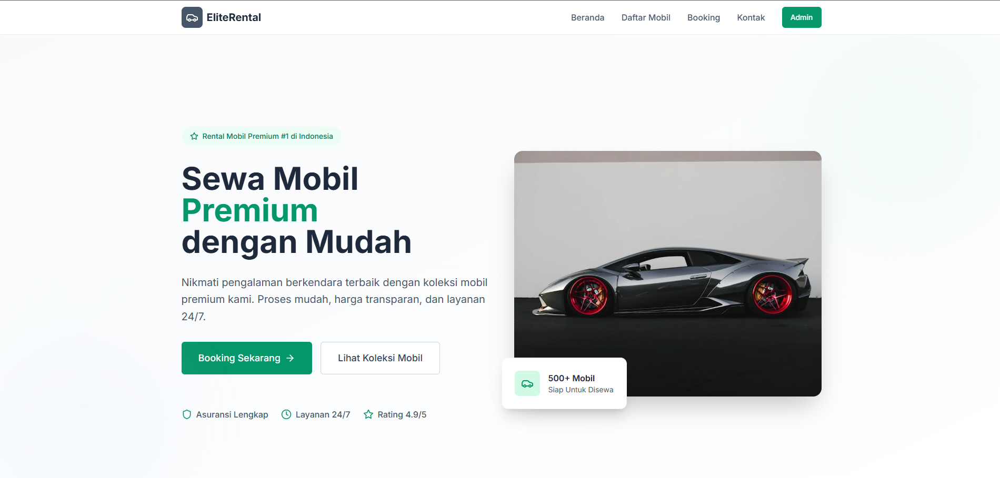

# 🚗 EliteRental - Premium Car Rental Platform

EliteRental adalah platform sewa mobil premium berbasis web yang dibangun dengan **Next.js**. Aplikasi ini mencakup halaman publik untuk pelanggan dan panel admin untuk pengelolaan mobil serta data booking. Desain modern dan responsif dengan dukungan animasi dan komponen UI interaktif.

## 📸 Preview

### Halaman Utama


### Dashboard Admin


---

## ⚙️ Tech Stack

### Frontend
- **[Next.js 13.5](https://nextjs.org/)** – Framework React yang mendukung SSR dan routing modern
- **Tailwind CSS 3.3** – Utility-first CSS framework
- **Radix UI** – Komponen UI headless untuk aksesibilitas tinggi
- **Framer Motion** – Animasi UI interaktif
- **Lucide Icons** – Ikon SVG open-source
- **React Hook Form + Zod** – Validasi dan manajemen form
- **Embla Carousel** – Komponen carousel ringan
- **Recharts** – Visualisasi data (admin dashboard)


## 🚀 Cara Menjalankan

### 1. Clone repo

```bash
git clone https://github.com/username/elite-rental.git
cd elite-rental
```

### 2. Install dependencies

```bash
npm install
# atau
yarn
```

### 3. Jalankan server development

```bash
npm run dev
# atau
yarn dev
```


